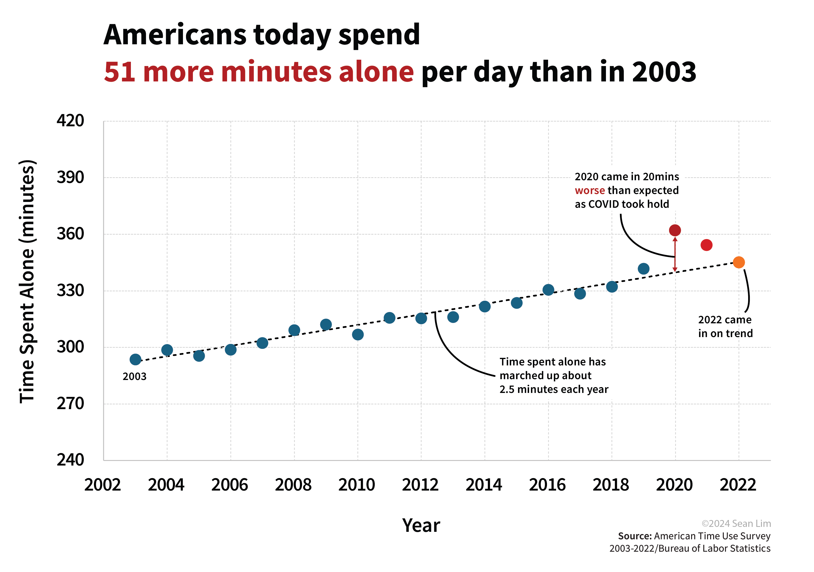
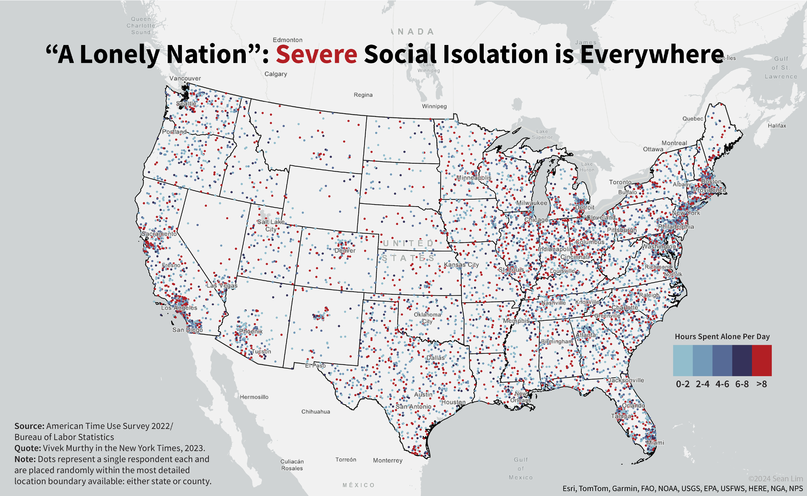
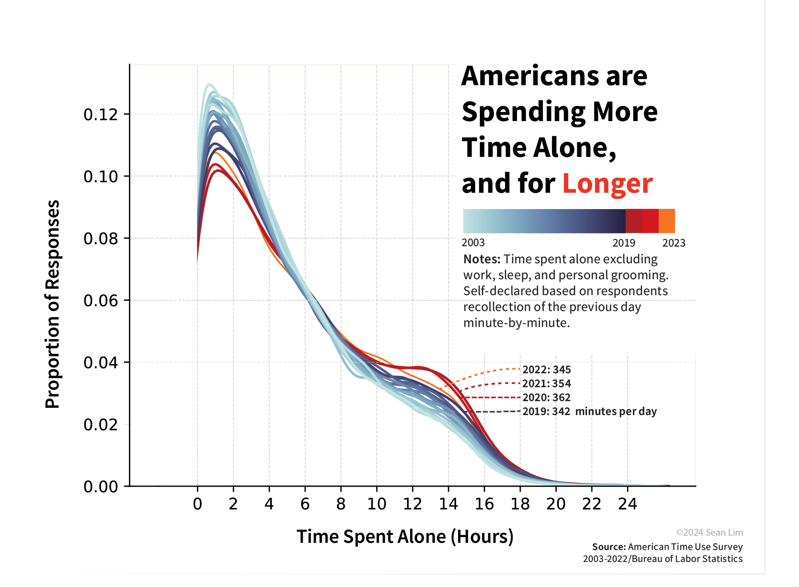
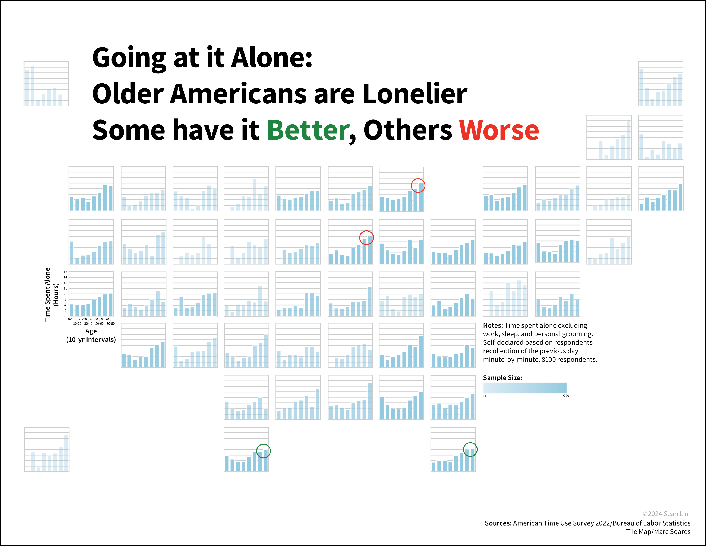
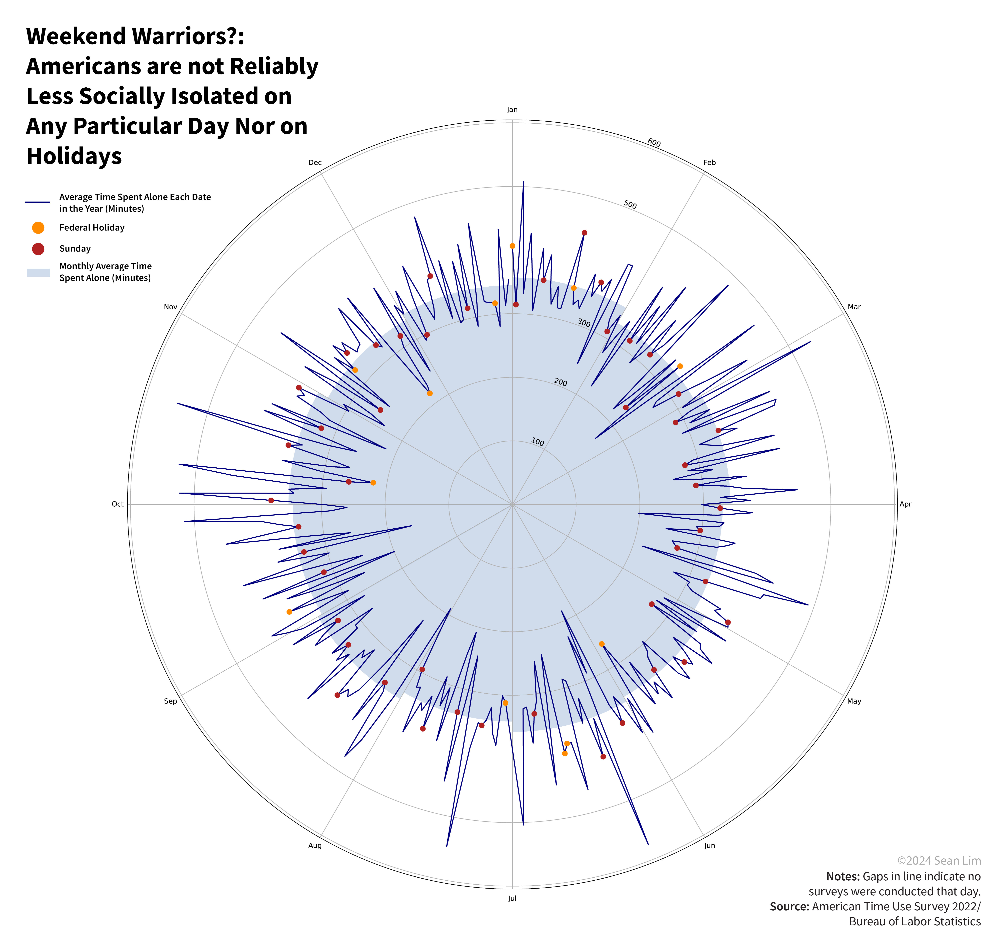
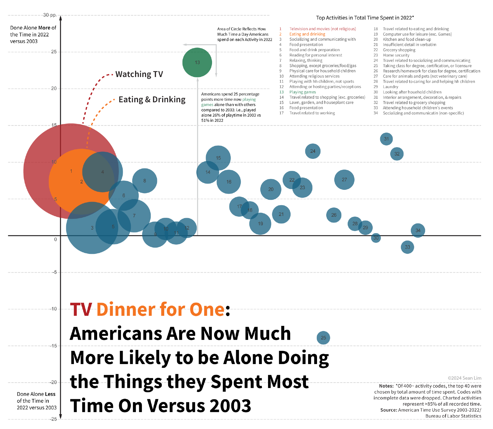

# Data Story: Loneliness in America: Critical Data Visualization

This was the final project for HIST449: Critical Data Visualization at Yale University that covered the humanities and technical aspects of data visualisation. The goal was to create a data story featuring narrative interspersed with graphics that conveyed a cohesive and compelling take about any topic of social importance. I told the story of American life being increasingly marked by time alone and loneliness through data from the American Time Use Survey. The Census Bureau ran survey asks 8000 Americans each year what they did the previous day minute by minute and who was with them during those activities. 

Tools/Technique: ArcGIS, Illustrator, Working with Census Bureau/Non-API datasets, Deepnote for Online Analysis 

